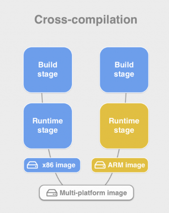

# Multi Arch for RTEMS


I would like to use multi arch, cross compiled builds for supporting RTEMS
and linux soft IOCs in the same Dockerfiles.

This way we get a matrix like so:


## Why Multi Arch, not just more Stages?

It is **important** that we use multi-arch instead of a 4 stage build.

With the 2 architectures we want to run mostly the SAME steps in the Dockerfile
just with the environment set up differently. With the two stages 'developer'
and 'runtime' we have a thread of separate stages throughout the image
hierarchy that run distinctly different steps.

## References

A good article on multi arch is here:
https://cloudolife.com/2022/03/05/Infrastructure-as-Code-IaC/Container/Docker/Docker-buildx-support-multiple-architectures-images/

But the above is going to a lot of trouble because it wants to run emulators.
We want to run with the same BUILDARCH but switch TARGETARCH and we also want
a custom TARGETARCH named something like 'rtems/powerpc'.

This article seems to describe a closer scenario:
https://www.docker.com/blog/faster-multi-platform-builds-dockerfile-cross-compilation-guide/

## Example

I have the following example working with docker. It looks like podman does now support
multi arch but slightly differently.

This Dockerfile forces the target architecture of the base (ubuntu) image to 
be AMD64 but then will create multiple target architectures from this if
invoked with buildx (see below).

```docker
##### shared environment stage #################################################

FROM --platform=amd64 ubuntu:22.04 AS environment

ARG TARGETPLATFORM BUILDPLATFORM

RUN echo "TARGET=${TARGETPLATFORM} BUILD=${BUILDPLATFORM}"

# environment
ENV EPICS_ROOT=/repos/epics

WORKDIR ${EPICS_ROOT}

COPY README.md .


##### build stage ##############################################################

FROM environment AS developer

ARG TARGETARCH TARGETPLATFORM TARGETVARIANT TARGETOS BUILDARCH BUILDPLATFORM BUILDVARIANT BUILDOS

RUN echo "--- $TARGETPLATFORM $TARGETARCH $TARGETVARIANT $TARGETOS" | tee target.txt
RUN echo "--- $BUILDPLATFORM $BUILDARCH $BUILDVARIANT $BUILDOS " | tee build.txt


##### runtime stage ############################################################

FROM environment AS runtime

# get the products from the build stage
COPY --from=developer ${EPICS_ROOT} ${EPICS_ROOT}
```

To use this example:
```bash
# create a buildx instance to use
$ docker buildx create --use
loving_allen

# build a two architecture image (rtems/powerpc/runtime is a made up arch)
# and push to ghcr (the local cache does not support multi-arch)
$ docker buildx  build --platform=rtems/powerpc/runtime,linux/amd64/runtime  -t ghcr.io/epics-containers/test-multiarch  --push .
...
...
...
 => => pushing manifest for ghcr.io/epics-containers/test-multiarch:latest@sha256:d5263f8bdbffa5380d1e544333f25d9b2398608d79d5c7d5d833aac3bd21edbb                             
 => [auth] epics-containers/test-multiarch:pull,push token for ghcr.io          
```

Note that building this image normally with docker succeeds but the values
of all TARGET/BUILD are blank. This means we can default to AMD64 when these
are blank and the usual workflow is supported.

```bash
$ docker build  -t ghcr.io/epics-containers/test-multiarch  .
```

## Show Stopper ?

The above approach allows us to pull our image and specify the platform

```bash
$ docker pull --platform linux/amd64/runtime  ghcr.io/epics-containers/test-multiarch
Using default tag: latest
...
Status: Downloaded newer image for ghcr.io/epics-containers/test-multiarch:latest
ghcr.io/epics-containers/test-multiarch:latest
$
```

BUT docker knows what host platform is and won't allow us to pull the rtems one
```
docker pull --platform rtems/powerpc/runtime  ghcr.io/epics-containers/test-multiarch
Using default tag: latest
latest: Pulling from epics-containers/test-multiarch
operating system is not supported
$
```

This is because we have coopted multi-arch, although we do cross compile as 
per recommendations. We do not want to run our cross compiled code in the 
target architecture.

The expected  way to do things is shown in this diagram from the second article 
linked above, blue represents x86_64 and orange the cross compile target.


